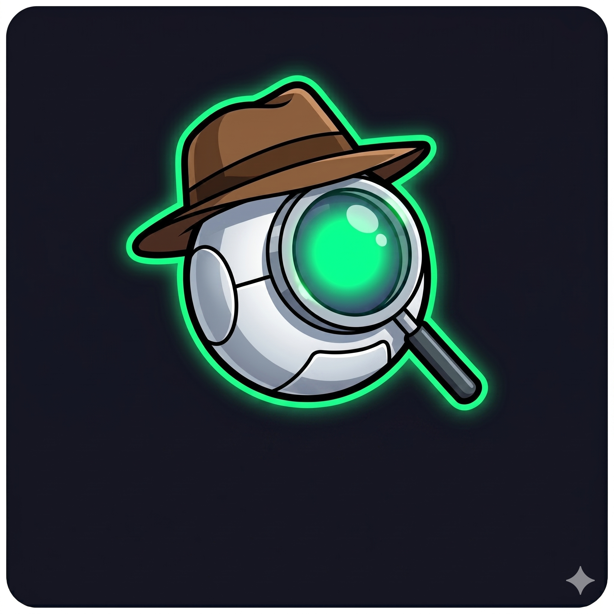

# 🛡️ AntiRug v3 — Solana Threat Intelligence Platform

> **Multi-agent AI pipeline that detects Solana rug pulls by analyzing people, wallets, and behavioral networks — not just tokens. Powered by 11 intelligence layers, entity tracking, and wallet graph analysis.**

[](https://solana.com)
[](https://react.dev)
[](LICENSE)



---

## 📌 Overview

AntiRug is a **production-grade Solana threat intelligence platform** that goes far beyond basic token scanning. It runs an **11-layer analysis pipeline** with 15+ specialized modules that evaluate on-chain risk, build wallet relationship graphs, detect bundled launches, track deployer history across multiple tokens, trace funding sources, simulate sells for honeypot detection, and produce actionable threat reports — all deterministically scored with AI-assisted reasoning.

### Core Philosophy

> Most scanners ask *"Is the token dangerous?"*
>
> AntiRug asks *"Who created it? Who owns it? Who controls liquidity? Who is secretly connected? Who is selling? Who funded them? Does it behave like previous rugs?"*
>
> **The token itself is rarely the scam. The people behind it are.**

### What Makes AntiRug Different

| Layer | What We Check | Why It Matters |
|-------|--------------|----------------|
| 🔐 **Token Security** | Mint/Freeze/Update/Metadata authority, Token2022 extensions | Basic hygiene — necessary but not sufficient |
| 💧 **Liquidity Intelligence** | LP lock/burn, exit slippage simulation, dry-run sell (honeypot detection) | Detects LP pulls and hidden sell taxes |
| 📊 **Holder Intelligence** | Gini coefficient, top holder concentration, holder growth slopes | Catches fake "distributed" tokens |
| 🕸️ **Wallet Intelligence** | Union-Find clustering, circular transfers, cross-token relationships, smart money | **Flagship** — catches coordinated insider schemes |
| 🚀 **Launch Intelligence** | Jito bundle detection, sniper dominance, same-slot buys | Exposes fake "fair launches" |
| 👤 **Deployer Intelligence** | Creator exit tracking, historical launches, reputation with time decay | **Moat** — tracks serial ruggers across tokens |
| 💰 **Funding Intelligence** | SOL origin tracing, exchange vs mixer vs known rug wallet | Catches wallet rotation scams |
| 📈 **Market Manipulation** | Wash trading ratio, self-trading, bot dominance index | Detects fake volume pumps |
| 🌐 **Social Intelligence** | X account age, domain age, GitHub quality | Lightweight verification only |
| 🧬 **Historical Similarity** | Feature-vector nearest-neighbor against rug/clean dataset | AI evidence layer (does NOT set risk score) |
| 🎭 **Entity Intelligence** | Entity resolution — groups wallets by actor, not address | **NEW** — scammers rotate wallets, AntiRug tracks the actor |
| 🤖 **Autonomous AI Agent** | Self-planning, self-learning agent runtime via ElizaOS | Orchestrates background scanning, Telegram alerts, and self-learning loops |

---

## 🏗️ Architecture

AntiRug uses a **parallel multi-agent pipeline** where 11 specialized layers run concurrently after the initial token scan, followed by a Critical Override Engine, Risk Trend Engine, and Rug Network Explorer:

```
                              ┌─────────────────────┐
                              │   Token Scanner      │
                              │   (Python + RPC)     │
                              └──────────┬──────────┘
                                         │
        ┌────────────────────────────────┼────────────────────────────────┐
        │                │               │               │               │
 ┌──────▼──────┐  ┌──────▼──────┐ ┌──────▼──────┐ ┌──────▼──────┐ ┌─────▼──────┐
 │Token Security│  │  Liquidity  │ │   Holder    │ │   Wallet    │ │  Launch    │
 │    (8%)      │  │   (15%)     │ │    (8%)     │ │   (22%)     │ │   (10%)    │
 │              │  │             │ │             │ │             │ │            │
 │• Authority   │  │• LP Lock    │ │• Gini Coeff │ │• Wallet     │ │• Bundler   │
 │  Risk Engine │  │• Liquidity  │ │• Top Holder │ │  Graph      │ │  Detector  │
 │              │  │  Shock      │ │  Conc.      │ │• Smart Money│ │• Sniper    │
 │              │  │• Dry-Run    │ │• Holder     │ │• Cross-Token│ │  Dominance │
 │              │  │  Sell Sim   │ │  Growth     │ │  Relations  │ │            │
 └──────┬──────┘  └──────┬──────┘ └──────┬──────┘ └──────┬──────┘ └─────┬──────┘
        │                │               │               │               │
 ┌──────▼──────┐  ┌──────▼──────┐ ┌──────▼──────┐ ┌──────▼──────┐ ┌─────▼──────┐
 │  Deployer   │  │  Funding    │ │   Market    │ │  Social     │ │ Historical │
 │   (15%)     │  │    (8%)     │ │  Manip (5%) │ │   (2%)      │ │ Sim. (2%)  │
 │             │  │             │ │             │ │             │ │            │
 │• Insider    │  │• SOL Origin │ │• Wash Trade │ │• X Age      │ │• Nearest   │
 │  Wallet     │  │• Exchange   │ │• Self-Trade │ │• Domain Age │ │  Neighbor  │
 │• Deployer   │  │  Detection  │ │• Bot Index  │ │• GitHub     │ │  vs Rugs   │
 │  Reputation │  │• Mixer/Rug  │ │             │ │             │ │            │
 │  (Time Decay)│ │  Detection  │ │             │ │             │ │            │
 └──────┬──────┘  └──────┬──────┘ └──────┬──────┘ └──────┬──────┘ └─────┬──────┘
        │                │               │               │               │
        │         ┌──────▼──────┐        │               │               │
        │         │   Entity    │        │               │               │
        │         │  Intel (5%) │        │               │               │
        │         │             │        │               │               │
        │         │• Entity     │        │               │               │
        │         │  Resolution │        │               │               │
        │         │• Actor DB   │        │               │               │
        │         └──────┬──────┘        │               │               │
        │                │               │               │               │
        └────────────────┼───────────────┼───────────────┼───────────────┘
                         │               │               │
                ┌────────▼───────────────▼───────────────▼────────┐
                │       RiskScoringAgent (11-Layer Aggregator)    │
                └────────────────────────┬───────────────────────┘
                                         │
                ┌────────────────────────▼───────────────────────┐
                │       Critical Override Engine (11 Rules)       │
                └────────────────────────┬───────────────────────┘
                                         │
                         ┌───────────────┼───────────────┐
                         │               │               │
              ┌──────────▼──────┐ ┌──────▼──────┐ ┌──────▼──────┐
              │  Risk Trend     │ │  Confidence  │ │ Rug Network │
              │  Engine         │ │  Engine 2.0  │ │ Explorer    │
              └──────────┬──────┘ └──────┬──────┘ └──────┬──────┘
                         │               │               │
                         └───────────────┼───────────────┘
                                         │
                          ┌──────────────▼──────────────┐
                          │   AntiRug Threat Report      │
                          └─────────────────────────────┘
```

---

## 📊 11-Layer Weight System

```
Token Security          8%
Liquidity Intelligence 15%
Holder Intelligence     8%
Wallet Intelligence    22%   ← Flagship
Deployer Intelligence  15%   ← Competitive Moat
Launch Intelligence    10%
Funding Intelligence    8%   ← Catches wallet rotation
Market Manipulation     5%
Social Intelligence     2%   ← Minimized (low predictive value)
Historical Similarity   2%   ← Evidence only
Entity Intelligence     5%   ← NEW (tracks actors, not wallets)
─────────────────────────
Total                 100%
```

> **Design principle:** On Solana, wallet behavior and funding relationships are dramatically more predictive than social metrics or basic token checks.

---

## 🔍 Intelligence Modules

### Token Security (8%)

| Module | File | What It Does |
|--------|------|-------------|
| **Authority Risk Engine** | `AuthorityRiskEngine.js` | Mint/Freeze/Update authority + Token2022 Transfer Hook + Permanent Delegate. Active = 90 risk, multisig reduces by 30%. |

### Liquidity Intelligence (15%)

| Module | File | What It Does |
|--------|------|-------------|
| **LP Lock Analyzer** | `LPLockAnalyzer.js` | LP burn/lock detection + LP ownership analysis. Supports Raydium Lock, UNCX, Team Finance. Burned = 5, Unlocked = 95. |
| **Liquidity Shock Agent** | `LiquidityShockAgent.js` | Liquidity change tracking (1h/6h/24h/7d) + exit slippage simulation ($100–$50k) + **dry-run sell simulation** to detect honeypots, hidden taxes, and transfer restrictions. |

### Holder Intelligence (8%)

| Module | File | What It Does |
|--------|------|-------------|
| **Blockchain Risk Analysis** | `BlockchainRiskAnalysisAgent.js` | Gini coefficient, top holder concentration (1/5/10/20), holder growth slopes, holder retention analysis. |

### Wallet Intelligence (22%) — Flagship

| Module | File | What It Does |
|--------|------|-------------|
| **Wallet Relationship Graph** | `WalletRelationshipGraph.js` | Union-Find clustering of connected wallets. Detects shared funding, circular transfers, insider clusters. CSR > 40% = critical override. **Cross-Token Relationship Engine** flags holders appearing in previous rugs. |
| **Smart Money Tracker** | `SmartMoneyTracker.js` | Tracks known profitable wallets via `smart_wallets.json`. Exiting = +20 risk, entering = -15 risk. |

### Launch Intelligence (10%)

| Module | File | What It Does |
|--------|------|-------------|
| **Bundler Detector** | `BundlerDetector.js` | Jito bundle detection, same-slot buys, shared tip payer analysis. >50% bundled = 90 risk. |
| **Sniper Dominance** | `SniperDominanceScorer.js` | Block-level supply capture analysis (Block 1/5/20). >40% sniper supply = 85 risk. |

### Deployer Intelligence (15%) — Competitive Moat

| Module | File | What It Does |
|--------|------|-------------|
| **Insider Wallet Scorer** | `InsiderWalletScorer.js` | Creator exit tracking. Holding = 10, partial sell = 50, fully exited = 95. |
| **Deployer Reputation DB** | `DeployerReputationDatabase.js` | SQLite-backed deployer history with **time-decay reputation formula**. Recent rugs weigh heavily; old rugs decay. Outputs: "Launched 12 tokens, 9 rugged within 14 days." |

### Funding Intelligence (8%)

| Module | File | What It Does |
|--------|------|-------------|
| **Funding Intelligence Tracker** | `FundingIntelligenceTracker.js` | Traces SOL origin — CEX (low risk) vs fresh wallet (high risk) vs mixer/known rug wallet (critical). Catches wallet rotation scams. |

### Entity Intelligence (5%) — NEW

| Module | File | What It Does |
|--------|------|-------------|
| **Entity Intelligence Engine** | `EntityIntelligenceEngine.js` | Groups wallets by **actor** using funding ancestry, temporal clustering, and cross-token overlap. Scammers rotate wallets; AntiRug tracks the entity behind them. |

### Market Manipulation (5%)

| Module | File | What It Does |
|--------|------|-------------|
| **Volume Manipulation Detector** | `VolumeManipulationDetector.js` | Wash Trading Ratio, self-trading detection (A→B→A), Bot Dominance Index. |

### Social Intelligence (2%)

| Module | File | What It Does |
|--------|------|-------------|
| **Sentiment Analysis** | `SentimentAnalysisAgent.js` | X account age, engagement quality, domain age, GitHub verification. Intentionally minimized. |

### Historical Similarity (2%)

| Module | File | What It Does |
|--------|------|-------------|
| **Historical Similarity Engine** | `HistoricalSimilarityEngine.js` | Nearest-neighbor comparison against known rug/clean dataset. **Evidence only** — does NOT set risk score. |

---

## 🚨 Critical Override Engine (11 Rules)

Hard floor rules that **cannot be overridden** by positive signals in other layers:

```
Tier 1 — Absolute Kill Switches (floor 95–100):
  IF dry-run sell failed (honeypot)        → risk = 100
  IF creator fully exited                  → floor = 95
  IF creator cluster supply > 40%          → floor = 95
  IF creator rug rate > 70%                → floor = 95
  IF entity rug rate > 70%                 → floor = 95
  IF active mint authority + supply growth → floor = 95

Tier 2 — Severe Red Flags (floor 85–90):
  IF LP unlocked + liquidity < $100K       → floor = 90
  IF bundled supply > 60%                  → floor = 90
  IF mint authority active (any)           → floor = 85

Tier 3 — High Concern (floor 80):
  IF freeze authority active               → floor = 80
  IF cross-token contamination > 50%       → floor = 80
```

---

## 📈 Risk Trend Engine — NEW

AntiRug doesn't just show the current risk — it tracks risk **trajectory**:

```
RISK TREND: DETERIORATING ↘
  Yesterday: 35/100 (LOW RISK)
  Today:     78/100 (HIGH RISK)
  Velocity:  +43 in 24h (CRITICAL ESCALATION)
  Trigger:   Creator sold 60% of holdings since last scan
```

| Trend Velocity | Label |
|----------------|-------|
| < -5/24h       | IMPROVING ↗ |
| -5 to +5/24h   | STABLE → |
| > +5/24h       | DETERIORATING ↘ |
| > +20/24h      | CRITICAL ESCALATION ⚠ |

---

## 🕸️ Rug Network Explorer — Signature Feature

When a scanned token has connections to previous rugs:

```
═══════════════════════════════════════════
  RUG NETWORK EXPLORER
═══════════════════════════════════════════

Linked Projects:
  ✗ Token A — "MoonDog" (RUGGED — LP drained, 3 days ago)
  ✗ Token B — "SafeRocket" (RUGGED — creator exit, 2 weeks ago)
  ✓ Token D — "LegitCoin" (ACTIVE — 45 days old)

Shared Wallets:
  • 7xK...9f2 — held tokens A, B, and current
  • 3mR...1d8 — funded deployers of A and current

Entity:
  • Entity #E-0047 — 4 wallets, 3 rugs, 1 active
  • Entity Rug Rate: 75%

Network Risk: 92/100
═══════════════════════════════════════════
```

---

## 🤖 Autonomous AI Agent Core (Powered by ElizaOS)

AntiRug features a fully autonomous AI agent runtime built on the **ElizaOS** framework (`eliza-runtime.ts`), which sits on top of our 11-layer threat detection engine. It operates as a self-directed security sentinel:

*   **Self-Planning Engine:** Every hour, the agent analyzes active market conditions (Fear & Greed Index), open sessions, and daily objectives to generate its own operational plan. It executes scheduled tasks (such as token scans and report generation) entirely without human intervention.
*   **Self-Learning Loop:** Every 6 hours, the agent executes a background learning cycle that parses historical scan results and newly recorded rugs, extracting behavioral safety patterns and updating its internal heuristic rules dynamically.
*   **Conversational Interface:** The agent connects directly to messaging channels (like Telegram) via its character configuration (`antirug.character.json`). It handles natural language inquiries, triggers on-demand scans, and posts real-time security alerts.
*   **Dynamic Adaptation:** The agent adjusts its operational focus, scanning aggressiveness, and user interaction styles depending on real-time market volatility and sentiment.

---

## 🚀 Quick Start

### Prerequisites

- **Node.js** ≥ 18.0.0
- **Python** ≥ 3.8 (for the token scanner)
- **OpenAI API Key** (for AI risk analysis)

### Installation

```bash
git clone https://github.com/AounJafri/antirug.git
cd antirug
npm install
```

### Environment Setup

Create a `.env` file in the project root:

```env
# Required
OPENAI_API_KEY=sk-your-openai-key

# Optional — defaults to public endpoint (rate limited)
SOLANA_RPC_URL=https://api.mainnet-beta.solana.com

# Server
PORT=3000
```

> **Tip:** For production use, we recommend a paid RPC provider like [Helius](https://helius.dev), [QuickNode](https://quicknode.com), or [Alchemy](https://alchemy.com) for faster, rate-limit-free scans.

### Start the Server

```bash
# Backend
npm start

# Frontend (separate terminal)
cd frontend
npm install
npm run dev
```

The API runs on `http://localhost:3000` and the frontend on `http://localhost:5173`.

---

## 🧪 API Endpoints

| Endpoint | Method | Description |
|----------|--------|-------------|
| `/api/health` | GET | Health check |
| `/analyze/:tokenAddress` | GET | Full 11-layer pipeline analysis (SSE streaming) |
| `/analyze/deep/:tokenAddress` | GET | Full pipeline + Expert Consensus (3 AI experts) |
| `/analyze` | POST | Full pipeline (JSON body: `{ "tokenId": "..." }`) |
| `/chat` | POST | Conversational AI with auto-pipeline trigger |
| `/chat/stream` | POST | SSE streaming chat |

### Example: Scan a Token

```bash
# Scan BONK token
curl http://localhost:3000/analyze/DezXAZ8z7PnrnRJjz3wXBoRgixCa6xjnB7YaB1pPB263

# Scan via POST
curl -X POST http://localhost:3000/analyze \
  -H "Content-Type: application/json" \
  -d '{"tokenId": "DezXAZ8z7PnrnRJjz3wXBoRgixCa6xjnB7YaB1pPB263"}'
```

### Example: Chat with the Agent

```bash
curl -X POST http://localhost:3000/chat \
  -H "Content-Type: application/json" \
  -d '{"message": "Is BONK safe?", "session_id": "my-session"}'
```

---

## 📁 Project Structure

```
antirug/
├── server.js                        # Express API + 11-layer pipeline orchestration
├── token_scanner_agent.py           # Solana RPC data collector (Python)
│
├── ── Token Security ──
├── AuthorityRiskEngine.js           # Mint/Freeze/Update/Token2022 authority analysis
│
├── ── Liquidity Intelligence ──
├── LPLockAnalyzer.js                # LP burn/lock detection + LP ownership
├── LiquidityShockAgent.js           # Liquidity shock + exit slippage + dry-run sell
│
├── ── Holder Intelligence ──
├── BlockchainRiskAnalysisAgent.js   # Gini coefficient + holder concentration + growth
│
├── ── Wallet Intelligence ──
├── WalletRelationshipGraph.js       # Union-Find clustering + cross-token relationships
├── SmartMoneyTracker.js             # Known profitable wallet tracking
├── smart_wallets.json               # Curated smart money address list
│
├── ── Launch Intelligence ──
├── BundlerDetector.js               # Jito bundle / coordinated launch detection
├── SniperDominanceScorer.js         # First-block buyer analysis
│
├── ── Deployer Intelligence ──
├── InsiderWalletScorer.js           # Creator wallet exit tracking
├── DeployerReputationDatabase.js    # SQLite deployer history + time-decay reputation
│
├── ── Funding Intelligence ──
├── FundingIntelligenceTracker.js    # SOL origin tracing (exchange/mixer/rug wallet)
│
├── ── Entity Intelligence ──
├── EntityIntelligenceEngine.js      # Actor resolution (groups wallets by entity)
│
├── ── Market Manipulation ──
├── VolumeManipulationDetector.js    # Wash trading + self-trading + bot dominance
│
├── ── Risk Fusion ──
├── RiskScoringAgent.js              # 11-layer weighted deterministic aggregator
├── CriticalOverrideEngine.js        # 11 floor-based override rules
├── RiskTrendEngine.js               # Risk trajectory tracking over time
├── RugNetworkExplorer.js            # Cross-project linking + network risk scoring
├── HistoricalSimilarityEngine.js    # Nearest-neighbor rug similarity (evidence only)
├── RugPredictorAgent.js             # AI-powered rug probability prediction
├── AlertAgent.js                    # Alert generation + classification
│
├── ── Intelligence ──
├── SentimentAnalysisAgent.js        # Social verification (X age, domain, GitHub)
├── ExpertConsensusAgent.js          # Multi-expert deep analysis
├── ConversationalAgent.js           # Natural language chat interface
├── ConversationManager.js           # Session memory management
├── llmClient.js                     # Shared OpenAI GPT wrapper
│
├── ── Data ──
├── db.sqlite                        # Deployer reputation + entity database
├── rug_dataset.json                 # Historical rug/clean token feature vectors
├── smart_wallets.json               # Curated smart money addresses
├── liquidity_history.json           # Historical liquidity tracking
│
├── ── Frontend ──
├── frontend/
│   ├── src/
│   │   ├── App.jsx                  # Main app + routing
│   │   ├── components/
│   │   │   ├── Header.jsx           # Navigation bar
│   │   │   ├── HeroInput.jsx        # Token input form
│   │   │   ├── ScanningAnimation.jsx # Animated scanning screen
│   │   │   ├── ResultsDashboard.jsx # Risk gauge + layer cards + trend + network
│   │   │   ├── ScanReportCard.jsx   # Layer-by-layer breakdown
│   │   │   ├── NetworkExplorerCard.jsx  # Rug network visualization [PLANNED]
│   │   │   ├── RiskTrendChart.jsx       # Risk trajectory chart [PLANNED]
│   │   │   ├── ChatMessage.jsx      # Chat bubble component
│   │   │   └── ChatInput.jsx        # Chat input bar
│   │   └── index.css                # Design system + animations
│   └── public/
│       └── logo.png                 # AntiRug logo
│
├── ── Config ──
├── .env                             # Environment variables
├── package.json                     # Dependencies
└── antirug.character.json           # AI agent personality config
```

---

## 🛠️ Tech Stack

| Layer | Technology |
|-------|-----------|
| **Runtime** | Node.js ≥ 18 + Python ≥ 3.8 |
| **AI / LLM** | OpenAI API (supplementary reasoning only) |
| **Blockchain** | Solana (SPL Tokens, Token-2022, Metaplex, Raydium) |
| **Database** | SQLite (deployer reputation, entity DB, risk history) |
| **Data Sources** | Solana RPC, GeckoTerminal, DexScreener |
| **Frontend** | React + Vite |
| **Deployment** | Railway (auto-deploy) |

---

## 🔬 Risk Scoring Formula

### Step 1: 11-Layer Weighted Aggregation

```
Score_raw = Σ (layer_score × layer_weight) for all 11 layers
```

### Step 2: Critical Overrides (11 floor-based rules)

Hard floors applied post-calculation for severe red flags. Cannot be reduced by positive signals.

### Step 3: Risk Trend Analysis

Computes risk trajectory from historical scans (IMPROVING / STABLE / DETERIORATING / CRITICAL ESCALATION).

### Step 4: Risk Classification

| Score | Level | Action |
|-------|-------|--------|
| 0–20 | 🟢 **SAFE** | Green light |
| 21–40 | 🟡 **LOW RISK** | Proceed with caution |
| 41–60 | 🟠 **CAUTION** | Investigate further |
| 61–80 | 🔴 **HIGH RISK** | Avoid entry |
| 81–100 | ⛔ **EXTREME RISK** | Do not touch |

---

## 🏆 The Competitive Moat

> **AntiRug's moat is not a feature — it's a dataset.** Every scan grows the Deployer Reputation DB, the Entity DB, and the Rug Dataset. Every rug AntiRug observes makes the system smarter. This is a compounding advantage.
>
> Most scanners analyze tokens. AntiRug analyzes **people and networks**.
>
> A scammer can create 100 new tokens. They **cannot** erase their on-chain history. **AntiRug remembers.**

---

## 🤝 Contributing

1. Fork the repository
2. Create a feature branch (`git checkout -b feature/new-module`)
3. Commit your changes (`git commit -m 'Add new detection module'`)
4. Push to the branch (`git push origin feature/new-module`)
5. Open a Pull Request

---

## 📜 License

MIT License — Built with ❤️ for the Solana community.